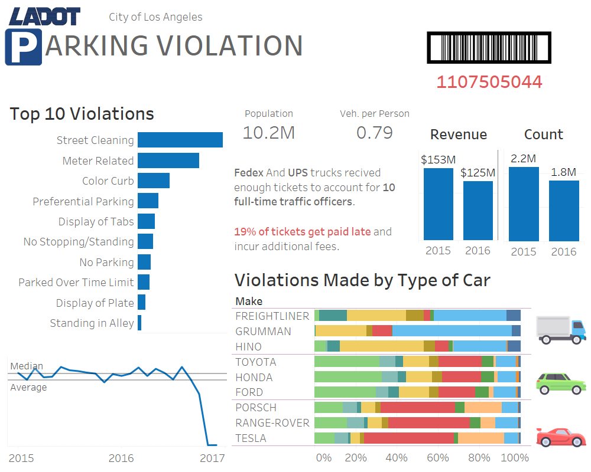
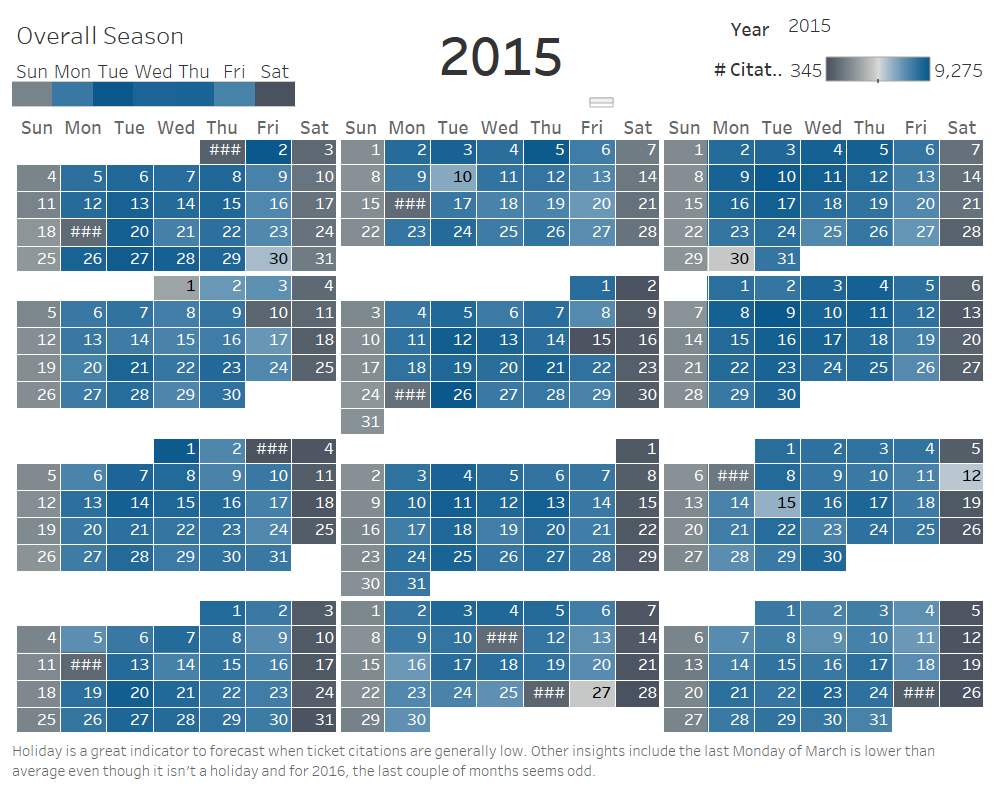
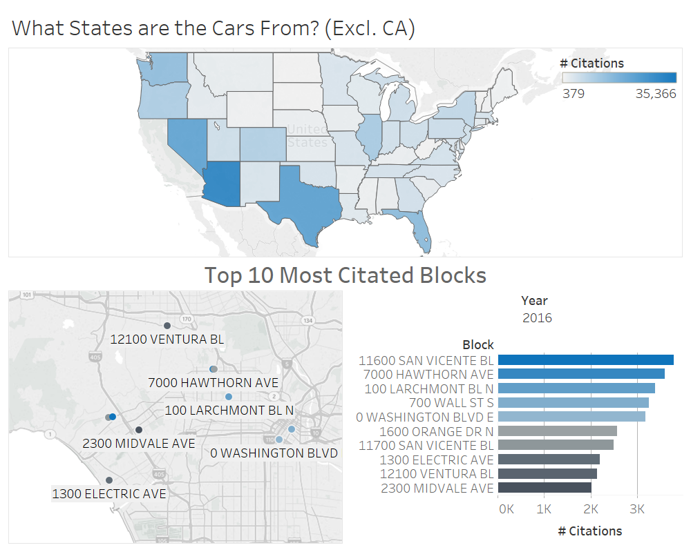

# Los Angeles Parking Citation Interactive Story Board

Used Python with Jupyter Notebook to clean and preform EDA on the dataset obtained from data.lacity.org. And then I used tableau to make visualization to present my findings.

Some findings were expected like popular areas has more tickets than other areas and street cleaning dominates in general. One surprising find was that individual with certain class of cars has different behavior like cargo cars have more color curb related violations, common cars have more street cleaning violations, and luxury cars have more meter related violations. 

[Hosted on Tableau Public](https://public.tableau.com/profile/jack.chen3893#!/vizhome/dashboard_322/LAParkingCitations?publish=yes)

## Static Snap Shot of Story

